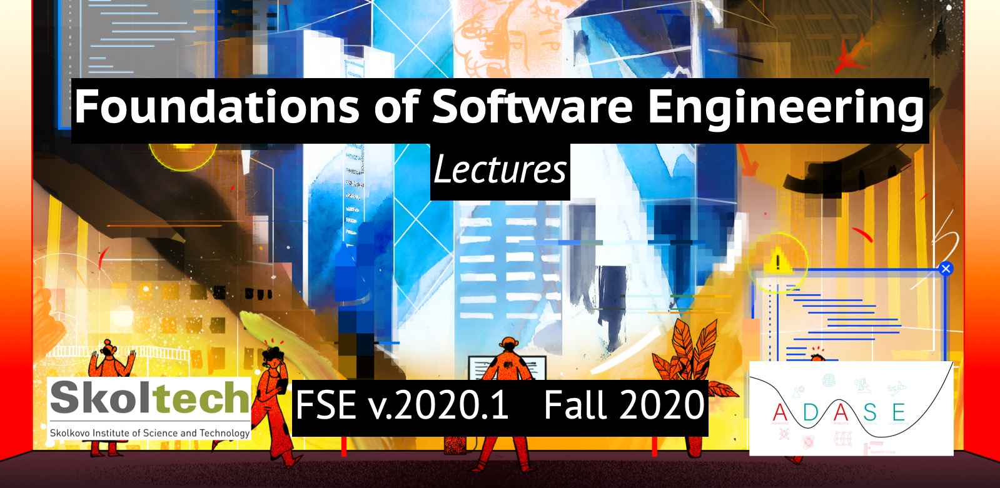

# Foundations of Software Engineering. Lectures

*Picture source: [https://www.theatlantic.com](https://www.theatlantic.com/technology/archive/2017/09/saving-the-world-from-code/540393/)* 

This repository contains lectures covered during the course Foundations of Software Engineering lectured in the Fall of 2020 at Skoltech.

The repository is organized by lectures in chronological order. 
Folder name scheme: *W{Week #}.{Tue *or* Fri}*.

## Main links

- [🛠️ Notion course main page](https://www.notion.so/fswe/Foundations-of-Software-Engineering-9e4ea95d99a343269529ee3b2bcb8ace)
- [📄 Syllabus](http://files.skoltech.ru/data/edu/syllabuses/2020/MA030406.pdf)
- [⭕ Canvas Page](https://skoltech.instructure.com/courses/2757)
- [✈️ Telegram Channel](https://t.me/joinchat/B4WXoBwKJC4RybPZfHjuNg)
- [🐱 Github Lectures](https://github.com/adasegroup/FSE2020_lectures)
- [😺 Github Seminars](https://github.com/adasegroup/FSE2020_seminars)
- [🎦 Youtube Lectures](https://www.youtube.com/playlist?list=PLwbgAkJDRI8trWTnwRmHDC8NDu3fOGtIK)
